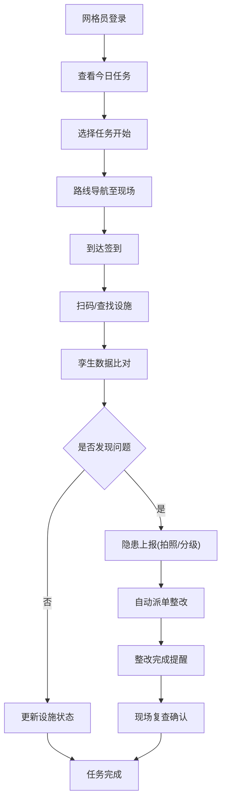
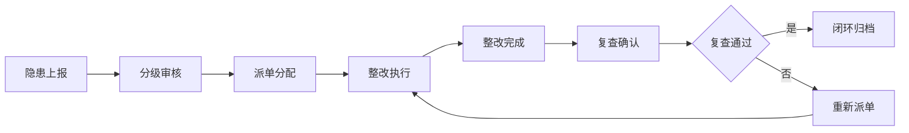

# 街区巡查孪生助手 - 产品需求文档(PRD)

## 1. 产品概述

面向城市网格员外勤工作的移动巡查应用，通过数字孪生技术实现管理端设施与现场情况的实时比对，提升城市精细化管理效率与问题处置闭环。

- **核心用户**：城市网格员、巡查人员、管理人员
- **核心价值**：提升巡查效率、规范问题上报流程、实现整改全流程跟踪、数据驱动绩效评估

## 2. 核心功能

### 2.1 用户角色

| 角色 | 说明 | 核心权限 |
|------|------|----------|
| 网格员 | 外勤巡查人员 | 任务执行、设施采集、隐患上报、整改复查 |
| 管理员 | 后台管理人员 | 设施同步、任务派单、整改分配、绩效查看 |

### 2.2 功能模块

1. **今日任务**：任务列表展示、签到打卡、路线导航、任务状态更新
2. **地图采集**：定位打点、设施标记、轨迹记录、附近历史问题查看
3. **设施卡片**：路灯/井盖/垃圾箱查询、孪生设施比对、二维码识别、设施详情
4. **隐患上报**：拍照录音、问题描述、分级分类、离线暂存、重复隐患提示
5. **整改跟踪**：派单列表、催办提醒、进度查看、复查确认
6. **消息**：系统通知、任务提醒、整改催办、消息分类
7. **个人中心**：绩效统计、轨迹回放、一键求助、设置中心

### 2.3 页面详情

| 页面名称 | 模块名称 | 功能描述 |
|---------|----------|----------|
| 今日任务 | 任务概览卡片 | 显示今日待办/进行中/已完成数量统计 |
| 今日任务 | 任务列表 | 按时间排序展示任务卡片，含类型、地点、优先级 |
| 今日任务 | 签到功能 | GPS定位签到、拍照签到、签到时间记录 |
| 今日任务 | 路线导航 | 调用地图导航至任务地点、多任务路径优化 |
| 地图采集 | 地图视图 | 显示当前位置、设施标记点、历史问题热力图 |
| 地图采集 | 打点标记 | 长按地图标记新设施/问题点、填写基本信息 |
| 地图采集 | 轨迹记录 | 实时记录巡查路线、支持暂停/继续/结束 |
| 设施卡片 | 设施列表 | 分类筛选（路灯/井盖/垃圾箱等）、附近优先 |
| 设施卡片 | 设施详情 | 孪生数据比对、状态信息、维护记录、二维码 |
| 设施卡片 | 扫码识别 | 扫描设施二维码快速定位设施档案 |
| 设施卡片 | 状态更新 | 现场拍照更新设施状态、与孪生数据差异标注 |
| 隐患上报 | 表单填写 | 问题标题、描述、类型选择、位置信息 |
| 隐患上报 | 多媒体采集 | 拍照/相册/录像/录音上传、图片标注 |
| 隐患上报 | 分级分类 | 紧急/一般/轻微三级、问题类型标签 |
| 隐患上报 | 离线暂存 | 无网络时本地存储、联网后自动同步 |
| 隐患上报 | 重复提示 | 基于位置/类型匹配历史问题、提示是否重复 |
| 整改跟踪 | 派单列表 | 待办/进行中/已完成/超期分类展示 |
| 整改跟踪 | 催办提醒 | 一键催办、超期自动提醒、责任人联系 |
| 整改跟踪 | 复查确认 | 整改后现场复查、拍照确认、结果反馈 |
| 消息 | 消息分类 | 系统通知/任务提醒/整改催办/聊天消息 |
| 消息 | 未读标识 | 未读红点、消息批量已读 |
| 个人中心 | 绩效统计 | 本月巡查里程、任务完成率、隐患上报数 |
| 个人中心 | 轨迹回放 | 历史巡查轨迹查看、时间轴播放 |
| 个人中心 | 一键求助 | 紧急联系、位置共享、录音取证 |
| 个人中心 | 设置中心 | 账号信息、离线数据清理、帮助反馈 |

## 3. 核心流程

### 3.1 日常巡查流程

网格员登录App → 查看今日任务列表 → 选择任务开始执行 → 到达现场GPS签到 → 扫描设施二维码/地图查找设施 → 比对孪生设施与现场情况 → 发现问题填写隐患上报（拍照+分级）→ 提交后自动派单 → 整改完成后现场复查确认 → 任务完成

### 3.2 隐患上报与整改闭环

## 4. 用户界面设计

### 4.1 设计风格

- **设计理念**：政务专业风 + 科技感数字孪生视觉
- **主色调**：深蓝渐变 `#1e3a8a → #2563eb`（政务权威感）
- **辅助色**：青绿 `#0d9488`（设施正常）、琥珀 `#f59e0b`（预警）、玫红 `#e11d48`（紧急）
- **中性色**：深灰 `#1f2937`、浅灰 `#f3f4f6`、纯白 `#ffffff`
- **按钮风格**：圆角12px、渐变背景、微阴影、点击缩放动效
- **字体**：主字体使用"思源黑体"，数字使用等宽字体增强数据感
- **布局风格**：移动端优先、卡片式布局、底部Tab导航
- **图标风格**：线性图标 + 渐变描边，设施图标采用几何化3D感设计
- **数字孪生元素**：扫描线动效、全息投影边框、数据流光粒子效果

### 4.2 页面设计概览

| 页面名称 | 模块名称 | UI元素设计 |
|---------|----------|------------|
| 今日任务 | 顶部统计栏 | 三色统计卡片（待办蓝/进行中青/完成绿）、脉冲数字动画 |
| 今日任务 | 任务卡片 | 左置彩色优先级条、地点距离、时间轴样式、滑动操作按钮 |
| 地图采集 | 地图容器 | 全屏地图、浮动定位按钮、设施标记闪烁点、轨迹渐变色线 |
| 地图采集 | 底部抽屉 | 上滑展开详情、半透明磨砂、拖动把手、列表分组 |
| 设施卡片 | 列表项 | 左侧3D设施图标、右侧孪生状态标签、扫码头像微动效 |
| 设施卡片 | 详情页 | 顶部全息设施图、扫描动画、孪生/现场数据双栏对比 |
| 隐患上报 | 表单区 | 分段选择器、图片宫格+号占位、分级选择胶囊按钮 |
| 整改跟踪 | 进度条 | 时间轴节点、节点状态图标、彩色进度百分比 |
| 消息 | 消息气泡 | 左头像+右内容、未读红点角标、分类标签切换 |
| 个人中心 | 绩效面板 | 环形进度图、柱状图动画、里程数字滚动 |

### 4.3 响应式设计

- **移动优先**：以 iPhone 14 Pro (393×852) 为基准设计
- **适配范围**：320px ~ 768px 移动端全覆盖
- **平板适配**：768px 以上采用双栏布局，左导航右内容
- **触控优化**：按钮最小44×44px、列表行高56px、手势滑动删除

### 4.4 动效设计

- **页面切换**：底部Tab切换带滑动指示器、页面水平滑入
- **加载状态**：骨架屏渐变闪烁、下拉刷新旋转logo
- **空状态**：微动插画 + 渐显文字
- **操作反馈**：按钮点击缩放0.95、提交成功对勾动画
- **孪生特效**：设施卡片顶部扫描线周期滚动、选中时全息光晕
