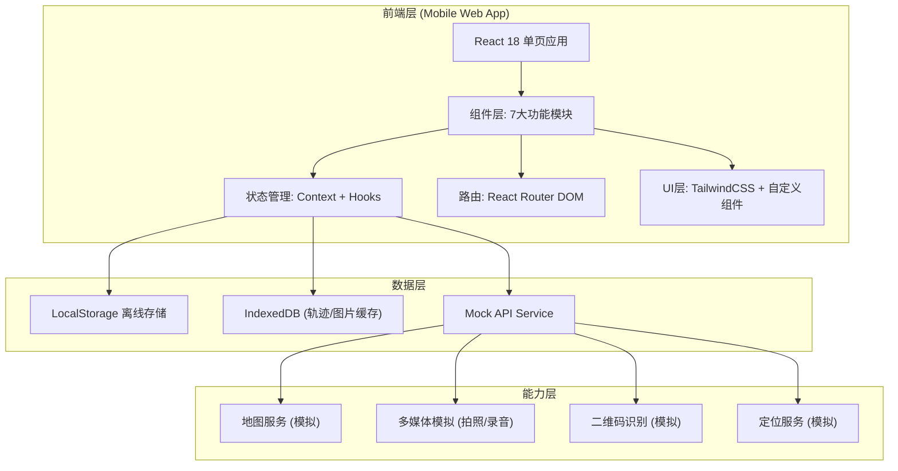
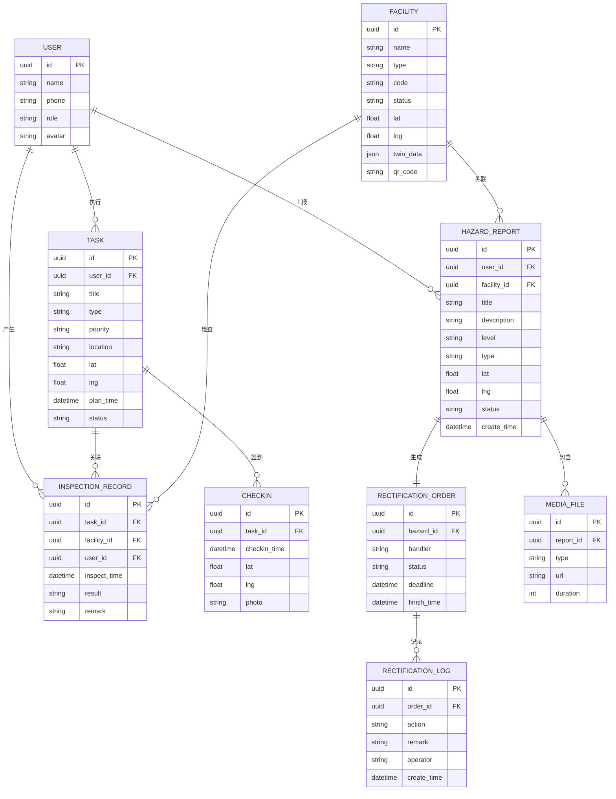

# 街区巡查孪生助手 - 技术架构文档

## 1. 架构设计



## 2. 技术说明

- **前端框架**: React 18 + TypeScript
- **构建工具**: Vite 5.0 (HMR热更新，快速启动)
- **样式方案**: TailwindCSS 3.4 + PostCSS Autoprefixer
- **路由管理**: React Router DOM 6
- **状态管理**: React Context + useReducer (轻量级全局状态)
- **图表可视化**: Recharts (绩效统计图表)
- **图标库**: Lucide React (清晰线性图标)
- **后端服务**: 无后端，全量 Mock 数据 + localStorage 持久化
- **数据存储**: LocalStorage (结构化数据) + IndexedDB (大文件/轨迹)

## 3. 路由定义

| 路由路径 | 页面名称 | 说明 |
|---------|----------|------|
| `/` | 今日任务首页 | App根路由，展示任务列表与统计 |
| `/map` | 地图采集 | 地图视图、打点、轨迹 |
| `/facilities` | 设施卡片 | 设施列表与分类筛选 |
| `/facilities/:id` | 设施详情 | 孪生数据比对、状态更新 |
| `/report` | 隐患上报 | 表单填写、多媒体采集 |
| `/rectification` | 整改跟踪 | 派单列表、进度跟踪 |
| `/messages` | 消息中心 | 消息分类与未读管理 |
| `/profile` | 个人中心 | 绩效、轨迹、设置 |
| `/help` | 一键求助 | 紧急联系页面 |
| `/scan` | 扫码识别 | 二维码扫描页面 |

## 4. 核心数据模型

### 4.1 ER 数据关系图



### 4.2 TypeScript 类型定义

```typescript
// 用户
export interface User {
  id: string;
  name: string;
  phone: string;
  role: 'inspector' | 'admin';
  avatar: string;
  department: string;
}

// 任务
export interface Task {
  id: string;
  userId: string;
  title: string;
  type: 'routine' | 'special' | 'emergency';
  priority: 'low' | 'medium' | 'high';
  location: string;
  address: string;
  lat: number;
  lng: number;
  planTime: string;
  status: 'pending' | 'in_progress' | 'completed' | 'expired';
  facilityIds: string[];
  distance?: number;
}

// 签到记录
export interface CheckIn {
  id: string;
  taskId: string;
  checkinTime: string;
  lat: number;
  lng: number;
  photo?: string;
}

// 设施
export interface Facility {
  id: string;
  name: string;
  code: string;
  type: 'lamp' | 'manhole' | 'bin' | 'bench' | 'sign' | 'other';
  status: 'normal' | 'warning' | 'damaged' | 'offline';
  location: string;
  lat: number;
  lng: number;
  installDate: string;
  lastMaintain: string;
  twinData: TwinFacilityData;
  qrCode: string;
  maintainer: string;
  maintainerPhone: string;
}

// 孪生设施数据
export interface TwinFacilityData {
  modelVersion: string;
  material: string;
  manufacturer: string;
  expectedLifespan: string;
  specs: Record<string, string>;
  lastSyncTime: string;
  syncedFromAdmin: boolean;
}

// 隐患上报
export interface HazardReport {
  id: string;
  userId: string;
  facilityId?: string;
  title: string;
  description: string;
  level: 'critical' | 'normal' | 'minor';
  type: string;
  lat: number;
  lng: number;
  address: string;
  status: 'submitted' | 'dispatching' | 'rectifying' | 'rechecking' | 'closed';
  createTime: string;
  mediaFiles: MediaFile[];
  isDuplicate?: boolean;
  duplicateOf?: string;
  savedOffline: boolean;
}

// 媒体文件
export interface MediaFile {
  id: string;
  type: 'image' | 'video' | 'audio';
  url: string;
  thumbUrl?: string;
  duration?: number;
  uploadTime: string;
}

// 整改工单
export interface RectificationOrder {
  id: string;
  hazardId: string;
  hazardTitle: string;
  hazardLevel: string;
  handler: string;
  handlerPhone: string;
  department: string;
  status: 'pending' | 'processing' | 'completed' | 'overdue' | 'recheck_failed';
  deadline: string;
  createTime: string;
  dispatchTime?: string;
  finishTime?: string;
  recheckTime?: string;
  logs: RectificationLog[];
  urgeCount: number;
}

// 整改日志
export interface RectificationLog {
  id: string;
  orderId: string;
  action: 'dispatch' | 'accept' | 'process' | 'complete' | 'urge' | 'recheck_pass' | 'recheck_fail' | 're_dispatch';
  remark: string;
  operator: string;
  createTime: string;
  photos?: string[];
}

// 巡查轨迹
export interface TrackPoint {
  lat: number;
  lng: number;
  time: string;
  speed?: number;
}

export interface TrackRecord {
  id: string;
  userId: string;
  date: string;
  startTime: string;
  endTime?: string;
  distance: number;
  points: TrackPoint[];
  status: 'recording' | 'paused' | 'finished';
}

// 消息
export interface Message {
  id: string;
  category: 'system' | 'task' | 'rectification' | 'chat';
  title: string;
  content: string;
  sender?: string;
  createTime: string;
  isRead: boolean;
  relatedId?: string;
}

// 绩效统计
export interface Performance {
  month: string;
  totalTasks: number;
  completedTasks: number;
  completionRate: number;
  totalDistance: number;
  hazardReports: number;
  criticalHazards: number;
  avgResponseTime: number;
  dailyRecords: DailyRecord[];
}

export interface DailyRecord {
  date: string;
  tasks: number;
  distance: number;
  reports: number;
}
```

## 5. 目录结构

```
src/
├── assets/              # 静态资源
│   └── images/          # 图片资源
├── components/          # 通用组件
│   ├── layout/          # 布局组件(底部导航/顶部栏)
│   ├── ui/              # UI基元(按钮/卡片/模态框)
│   └── common/          # 业务组件(设施图标/状态标签)
├── context/             # Context 状态管理
│   ├── AppContext.tsx   # 全局状态
│   ├── TaskContext.tsx  # 任务状态
│   └── TrackContext.tsx # 轨迹状态
├── data/                # Mock 数据
│   ├── tasks.ts
│   ├── facilities.ts
│   ├── hazards.ts
│   └── messages.ts
├── hooks/               # 自定义 Hooks
│   ├── useLocation.ts   # 定位Hook
│   ├── useOffline.ts    # 离线Hook
│   └── useTrack.ts      # 轨迹Hook
├── pages/               # 页面组件
│   ├── tasks/           # 今日任务
│   ├── map/             # 地图采集
│   ├── facilities/      # 设施卡片
│   ├── report/          # 隐患上报
│   ├── rectification/   # 整改跟踪
│   ├── messages/        # 消息中心
│   ├── profile/         # 个人中心
│   └── common/          # 通用页面(扫码/求助)
├── router/              # 路由配置
│   └── index.tsx
├── types/               # 类型定义
│   └── index.ts
├── utils/               # 工具函数
│   ├── distance.ts      # 距离计算
│   ├── storage.ts       # 本地存储
│   └── format.ts        # 格式化
├── App.tsx
├── main.tsx
└── index.css
```

## 6. 全局状态管理

### AppContext 全局状态
```typescript
interface AppState {
  user: User | null;
  online: boolean;
  pendingSyncQueue: HazardReport[];
  currentPosition: { lat: number; lng: number } | null;
}
```

### TaskContext 任务状态
```typescript
interface TaskState {
  tasks: Task[];
  currentTask: Task | null;
  trackRecords: TrackRecord[];
  activeTrack: TrackRecord | null;
}
```

## 7. 性能优化

- **路由懒加载**: 各页面使用 React.lazy + Suspense 按需加载
- **图片优化**: 列表使用缩略图、详情图懒加载、WebP优先
- **列表虚拟滚动**: 长列表(>50条)使用虚拟滚动
- **状态按需更新**: 使用 memo/useMemo/useCallback 减少重渲染
- **离线存储策略**: 关键数据预加载、图片分片存储、增量同步
- **组件粒度**: 合理拆分组件、避免全局状态滥用
